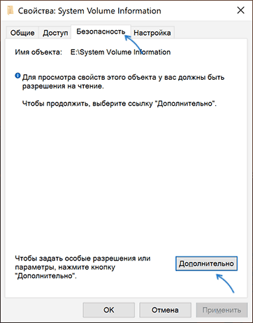
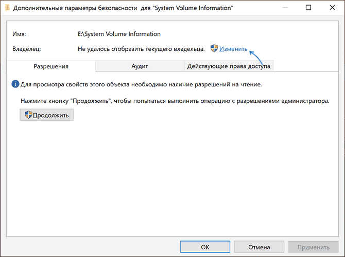
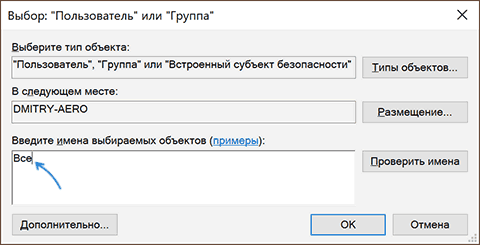
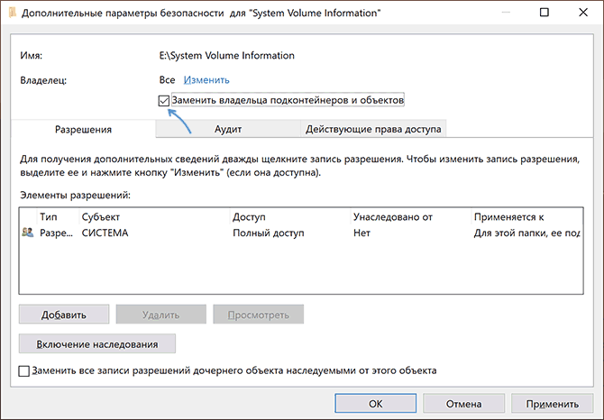
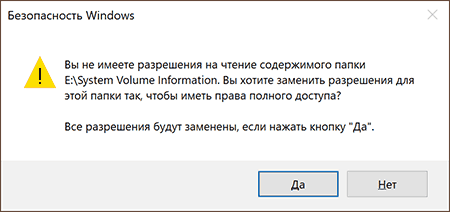
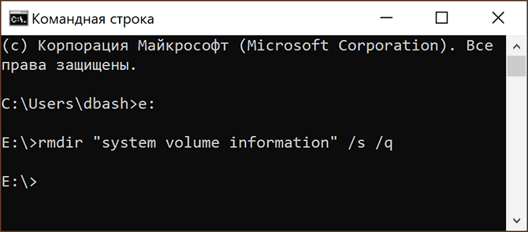

# 032. Как удалить System Volume Information с флешки
- https://remontka.pro/system-volume-information-usb-flash/
***

> Папка "System Volume Information" содержит необходимые системные данные, в частности
> 
> - Точки восстановления Windows (если включено создание точек восстановления для текущего диска).
> - Базы данных службы индексирования, уникальный идентификатор для накопителя, используемый Windows.
> - Информацию теневого копирования тома ([Историю файлов Windows](https://remontka.pro/file-history-windows-10/)).
>
> Иначе говоря, в папке "System Volume Information" хранятся данные, необходимые для работы служб с этим накопителем, а также данные для восстановления системы или файлов с помощью средств восстановления Windows.

## Итак, приступим
1. Нажмите правой кнопкой по папке "System Volume Information" и выберите пункт `Свойства` в контекстном меню.

2. Перейдите на вкладку `Безопасность` и нажмите кнопку `Дополнительно`.  
   

3. В пункте `Владелец` нажмите кнопку `Изменить`.  
   

4. В поле `Введите имена выбираемых субъектов` введите `Все` и нажмите `Ок`.  
   

5. Отметьте пункт `Заменить владельца подконтейнеров и объектов`.  
   

6. Нажмите `Ок`, подтвердите изменения разрешений, нажав `Да` и нажмите `Ок` в окне свойств папки.  
   

7. Запустите командную строку и введите команду `Z:` *(заменив Z на букву флешки)* и нажав Enter.  
   Затем введите команду: `rmdir "system volume information" /s /q`  
   

8. В результате проделанных действий рассматриваемая папка будет удалена с накопителя.
И чтобы он больше не создавался, можно создать пустой файл `System Volume Information` и задать ему атрибуты `Только чтения` и `Скрытый`.

