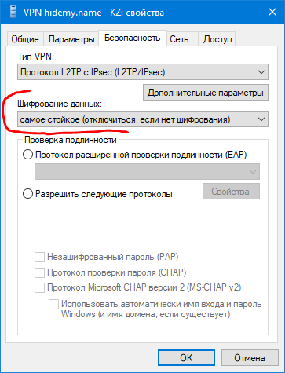
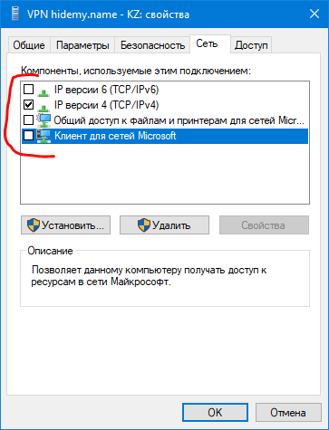

# 035. Настройка VPN без сторонних программ

- https://hidemy.name/faq/vpn/vpn-installation-and-configuration/without-applications/windows/l2tp/
---

- **Поставщик услуг VPN:** `Windows (встроенные)`
- **Имя подключения:** любое, например - `VPN hidemy.name - KZ`
- **Имя или адрес сервера:** IP адрес сервера  
  ( для hidemy.name взять отсюда: https://hidemy.name/api/pptp.php?serverlist )
- **Тип VPN:** `L2TP/IPsec с общим ключом`
- **Общий ключ:** для hidemy.name `incloaknetwork`
- **Тип данных для входа:** `Имя пользователя и пароль`
- **Имя пользователя (необязательно):** для hidemy.name - ваши 15 цифр
- **Пароль (необязательно):** для hidemy.name - ваши 4 цифры
- Ещё стоит сделать это:  
   

