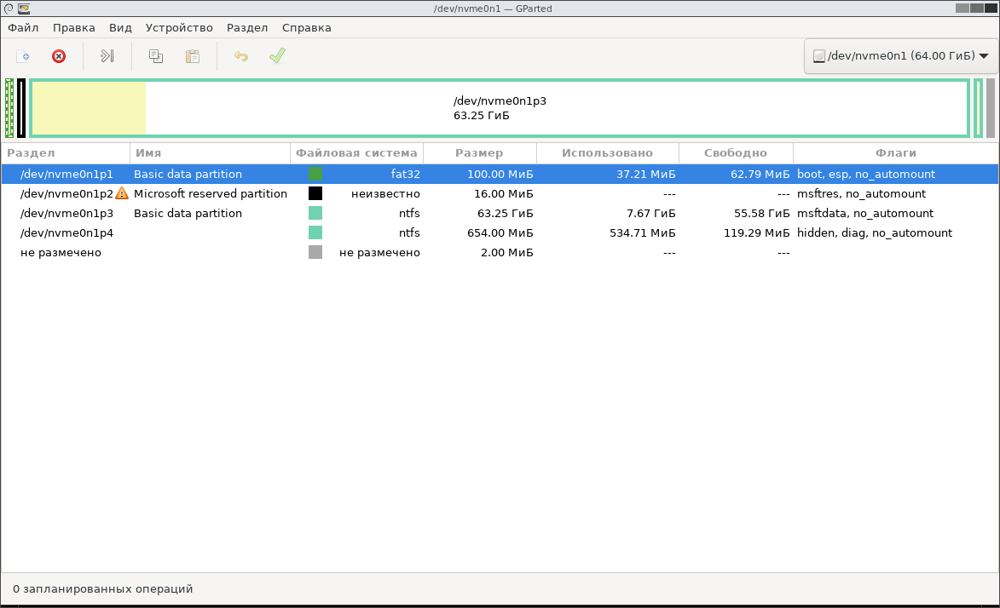
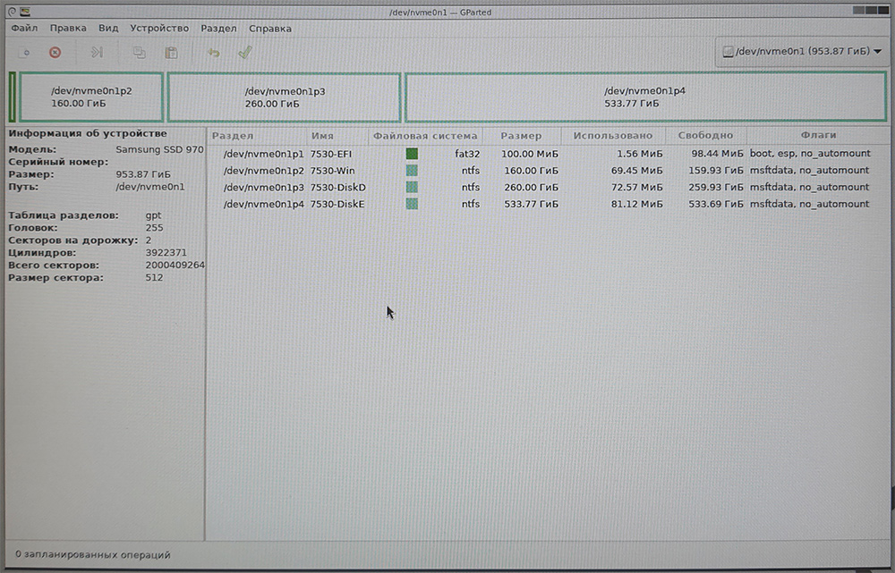

# Установка Windows

Windows 11 LTSC по умолчанию создаёт такие разделы:  


## Этап 0
- Отключаем **TPM**
- Включаем **Secure Boot**
- Конвертируем LTSC в IoT LTSC: `slmgr.vbs -ipk CGK42-GYN6Y-VD22B-BX98W-J8JXD`
    

## Этап 1 — **HWID Activation**
Если цифровая лицензию уже есть - пропускаем.  
Нам нужно получить цифровую лицензию через **HWID Activation**.  
Будет использовать **MAS** - https://massgrave.dev/

> MAS Latest Release  
> Last Release - v2.7 (6-Sep-2024)
> - https://github.com/massgravel/Microsoft-Activation-Scripts
> - https://dev.azure.com/massgrave/_git/Microsoft-Activation-Scripts
> - https://git.activated.win/massgrave/Microsoft-Activation-Scripts


1. Система должна быть сконвертирована в IoT LTSC.
2. Чтобы скачать, открываем репозитории на GitHub и нажимает на `Code` → `Download ZIP` .
3. Открывает `Microsoft-Activation-Scripts-master.zip` и запускаем оттуда: `MAS\All-In-One-Version-KL\MAS_AIO.cmd`  
	
4. Выбираем `[1]` HWID.

После получения цифровой лицензии можно отформатировать и переустановить систему. Лицензия сохраниться.
Главное на забыть после установки ввести снова:
```
slmgr.vbs -ipk CGK42-GYN6Y-VD22B-BX98W-J8JXD
```


## Вариант 1 — Обычная установка (или вариант 2)
1. В начале установки Windows 11, запускаем файл `Win11-InstallNoTPM.reg` , чтобы обойти ограничение TPM.
	- **Содержание файла**
		```
		Windows Registry Editor Version 5.00

		; Файл нужно запустить во время установки Windows, чтобы обойти нижеперечисленные ограничение.
		; 2024-10-03 // v1

		[HKEY_LOCAL_MACHINE\SYSTEM\Setup\LabConfig]
		"BypassTPMCheck"=dword:00000001
		;"BypassCPUCheck"=dword:00000001
		;"BypassSecureBootCheck"=dword:00000001
		;"BypassRAMCheck"=dword:00000001
		;"BypassStorageCheck"=dword:00000001
		```

2. *К сожалению Windows 11 24H2 LTSC отказывается устанавливается без MSR-раздела (msftres).*
Создал это разделе в самом установщике:  

    
3. Когда установка завершена конвертирует LTSC в → IoT LTSC
	```
	slmgr.vbs -ipk CGK42-GYN6Y-VD22B-BX98W-J8JXD
	```

Всё


## Вариант 2 — Сложная установка без "Microsoft Reserved Partition (MSR)" и "Recovery Partition"

1. Через GParted создаём нужные разделы:
	


2. Запускаем установщик Windows и сразу нажимает `Shift + F10` .
	Назначаем буквы для дисков: "EFI" → S ;  "Disk C" → W.
	```
	DISKPART

	list disk
	sel disk X
	list part
	sel part X

	list volume

	assign letter=S
	assign letter=W
	```

    Пусть к файлу `F:\sources\install.wim` (вместо `F:\` пишем правильную букву).  
    Получает информацию о всех доступных **индексах** в образе `install.wim` :  
    ```
    dism /get-imageinfo /imagefile:"F:\sources\install.wim"
    ```
    
    Указываем нужные `index` и букву диска где будет установлен Windows.
    ```
    dism /apply-image /imagefile:"F:\sources\install.wim" /index:4 /applydir:W:\
    ```
    
    Создаём EFI файл на EFI разделе
    ```
    bcdboot W:\Windows /s S: /f UEFI
    ```

2. Конвертирует LTSC → IoT LTSC
    ```
    slmgr.vbs -ipk CGK42-GYN6Y-VD22B-BX98W-J8JXD
    ```

    Я это делал в момент конфигурации профиля ещё в установщики но можно в любое время, но до активации.