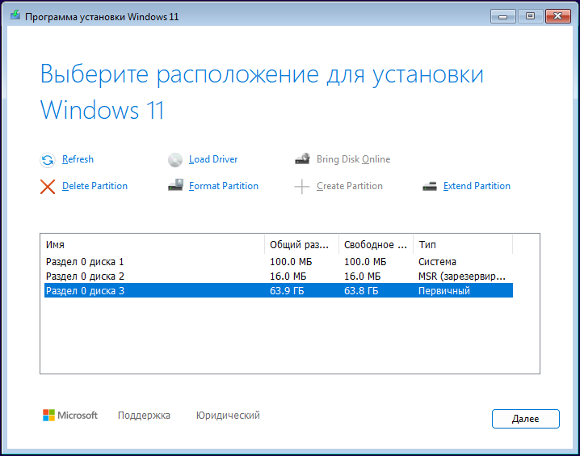

# Установка-Активация Windows

## Общее
- **TPM** - Отключить
- **Secure Boot** - Включить
- Размер раздела указываю на 1MB больше, чтобы было 100GB вместо 99.9GB


## Вариант 1 - Обычная установка
1. **Новый установщик** Windows 11 24H2 автоматический создаёт **MSR-раздел** (msftres).  
      
   Но можно выбрать `Предыдущая версия настройки` и откроеться **старый установщик**, он автоматический не создаёт **MSR-раздел**.

2. В начале установки Windows 11, запускаем файл `Win11-InstallNoTPM.reg`, чтобы обойти ограничение TPM.
   - **Win11-InstallNoTPM.reg**
     ```
     Windows Registry Editor Version 5.00
     
     ; Файл нужно запустить во время установки Windows, чтобы обойти нижеперечисленные ограничение.
     ; 2024-10-03 // v1
     
     [HKEY_LOCAL_MACHINE\SYSTEM\Setup\LabConfig]
     "BypassTPMCheck"=dword:00000001
     ;"BypassCPUCheck"=dword:00000001
     ;"BypassSecureBootCheck"=dword:00000001
     ;"BypassRAMCheck"=dword:00000001
     ;"BypassStorageCheck"=dword:00000001
     ```
 
3. Сразу после установки во время OOBE (первоначальной настройки) конвертирует "LTSC" в "IoT LTSC".


## Вариант 2 - через DISM
1. Через GParted создаём нужные разделы:  
   

2. Запускаем установщик Windows и сразу нажимает `Shift + F10`.  
   Назначаем буквы для дисков: `"EFI" --> S` , `"Disk C" --> W`.
   ```batch
   DISKPART
   
   list disk
   sel disk X
   
   list part
   sel part X
   
   assign letter=S
   assign letter=W
   
   list vol
   
   exit
   ```

3. **install.wim** - на установочном диске, путь к WIM-файлу `F:\sources\install.wim`.
   
   - Получаем информацию о всех доступных **индексах** в образе `install.wim`:
     ```
     dism /get-imageinfo /imagefile:"F:\sources\install.wim"
     ```
     
   - Указываем нужный **индекс** (index) и **букву диска** (applydir) где будет установлен Windows:
     ```
     dism /apply-image /imagefile:"F:\sources\install.wim" /index:4 /applydir:W:\
     ```
     
   - Создаём EFI на EFI разделе:
     ```
     bcdboot W:\Windows /s S: /f UEFI
     ```

3. Конвертирует "LTSC" --> "IoT LTSC" (желательно ещё во время OOBE)


*********************************
<br /><br />


## Конвертация LTSC --> IoT LTSC
1. Устанавливаем **Windows LTSC**.
2. Сразу после установке во время OOBE (первоначальной настройки), (хотя можно и потом) вводим:

   - для Windows 10 LTSC 21H2 - *(IoT Enterprise LTSC 2021 / IoTEnterpriseS)*
     ```batch
     slmgr.vbs -ipk QPM6N-7J2WJ-P88HH-P3YRH-YY74H
     ```
   
   - для Windows 11 LTSC 24H2 - *(IoT Enterprise LTSC 2024 / IoTEnterpriseS)*
     ```batch
     slmgr.vbs -ipk CGK42-GYN6Y-VD22B-BX98W-J8JXD
     ```

3. Затем нужно активизировать систему **HWID активатором**.

Если вы будете переустанавливать систему, то точно так же установитье **LTSC** и сконвертируйте в **IoT LTSC**,
НО активатор уже использовать не нужно будет. Система активируется сама, после ввода этого ключа и подключении к интернету.

- https://massgrave.dev/hwid
- https://windows64.net/453-windows-10-iot-ltsc-hwid.html


## Активация - **HWID Activation**
Если цифровая лицензию уже есть (или другая нужная лицензия) - пропускаем.  
Если нет, будем использовать **MAS** - https://massgrave.dev/

> MAS Latest Release  
> Last Release - v2.7 (6-Sep-2024)
> - https://github.com/massgravel/Microsoft-Activation-Scripts
> - https://dev.azure.com/massgrave/_git/Microsoft-Activation-Scripts
> - https://git.activated.win/massgrave/Microsoft-Activation-Scripts

- "LTSC" версия должна быть сконвертирована в "IoT LTSC".
- Чтобы скачать, открываем репозитории на GitHub и нажимает на `Code` → `Download ZIP`.
- Открываем `Microsoft-Activation-Scripts-master.zip` и запускаем оттуда: `MAS\All-In-One-Version-KL\MAS_AIO.cmd`  
  
- Выбираем - `[1]` HWID.

После получения цифровой лицензии можно отформатировать и переустановить систему. Лицензия сохраниться.  
**NB!** После переустановки "LTSC", его нужно вначале снова сконвертировать в "IoT LTSC".


*****************************************************
<br /><br />


## В качестве информации

- Windows 11 LTSC по умолчанию создаёт такие разделы:  
  


