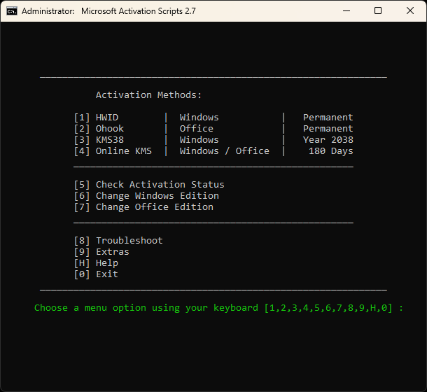

# Установка-Активация Windows

## Общее

- **TPM** - Отключить
- **Secure Boot** - Включить
- Размер раздела указываю на 1MB больше, чтобы было 100GB вместо 99.9GB


<br /><br />
## Обычная установка

1. Создаём разделы через **Gparted**  
   [](i/004.jpg)

2. В **новом устновщике** Windows 11 24H2 выбрать --> `Предыдущая версия настройки`  
   *(новый установщик автоматический создаёт **MSR-раздел** (msftres)).*

3. В начале установки Windows 11, запускаем файл `+Win11-InstallNoTPM-v1.reg`  
   *(чтобы обойти ограничение TPM)*
   - **Win11-InstallNoTPM.reg**
     ```
     Windows Registry Editor Version 5.00

     ; Файл нужно запустить во время установки Windows, чтобы обойти нижеперечисленные ограничение.
     ; 2024-10-03 // v1

     [HKEY_LOCAL_MACHINE\SYSTEM\Setup\LabConfig]
     "BypassTPMCheck"=dword:00000001
     ;"BypassCPUCheck"=dword:00000001
     ;"BypassSecureBootCheck"=dword:00000001
     ;"BypassRAMCheck"=dword:00000001
     ;"BypassStorageCheck"=dword:00000001
     ```

4. Во время OOBE (первоначальной настройки) конвертируем "LTSC" в "IoT LTSC".

5. **+OOBE-Disable_Device_AutoEncryption-v1.reg**  
   ```
   Windows Registry Editor Version 5.00

   ; Отключает автоматическое шифрование BitLocker в Windows.
   ; 2025-02-06 // v1

   ; Как предотвратить шифрование?
   ; Вручную на этапе OOBE (экране с выбором региона) нажмите Shift + F10 и запустите этот файл.

   ; https://outsidethebox.ms/22452/#0233


   [HKEY_LOCAL_MACHINE\SYSTEM\CurrentControlSet\Control\BitLocker]
   "PreventDeviceEncryption"=dword:00000001
   ```


<br /><br />
## Если нужно установить на **VHD**
```
DISKPART

list vol

select vdisk file="F:\_VHD\Win11ltsc.vhdx"
attach vdisk
```


<br /><br />
## Или через DISM

1. Запускаем установщик Windows и сразу нажимает `Shift + F10`.  
   Назначаем буквы для дисков: **"EFI" --> S** , **"Disk C" --> W**.
   ```
   DISKPART
   
   list disk
   sel disk X
   
   list part
   sel part X
   
   assign letter=S
   assign letter=W
   
   list vol
   
   exit
   ```

2. **install.wim** - на установочном диске ( `F:\sources\install.wim` ).
   
3. Получаем информацию о всех доступных **индексах** в образе `install.wim`:
   ```
   dism /get-imageinfo /imagefile:"F:\sources\install.wim"
   ```

4. Указываем нужный **индекс** (index) и **букву диска** (applydir) где будет установлен Windows:
   ```
   dism /apply-image /imagefile:"F:\sources\install.wim" /index:4 /applydir:W:\
   ```

5. Создаём EFI на EFI разделе:
   ```
   bcdboot W:\Windows /s S: /f UEFI
   ```


<br /><br />
## Конвертация LTSC --> IoT LTSC

Сразу после установке, во время OOBE (первоначальной настройки), (хотя можно и потом) вводим:

- для Windows 10 LTSC 21H2 - *(IoT Enterprise LTSC 2021 / IoTEnterpriseS)*
  ```
  slmgr.vbs -ipk QPM6N-7J2WJ-P88HH-P3YRH-YY74H
  ```
   
- для Windows 11 LTSC 24H2 - *(IoT Enterprise LTSC 2024 / IoTEnterpriseS)*
  ```
  slmgr.vbs -ipk CGK42-GYN6Y-VD22B-BX98W-J8JXD
  ```

NB! Первый раз, на новом ПК, нужно активировать систему через **HWID активатором**.

- https://massgrave.dev/hwid
- https://windows64.net/453-windows-10-iot-ltsc-hwid.html


<br /><br />
## Активация - HWID Activation (только один раз)
Если цифровая лицензию уже есть (или другая нужная лицензия) - пропускаем.  
Если нет, будем использовать **MAS** - https://massgrave.dev/

> MAS Latest Release  
> Last Release - v2.7 (6-Sep-2024)
> - https://github.com/massgravel/Microsoft-Activation-Scripts
> - https://dev.azure.com/massgrave/_git/Microsoft-Activation-Scripts
> - https://git.activated.win/massgrave/Microsoft-Activation-Scripts

- "LTSC" версия должна быть сконвертирована в "IoT LTSC".
- Чтобы скачать, открываем репозитории на GitHub и нажимает на `Code` → `Download ZIP`.
- Открываем `Microsoft-Activation-Scripts-master.zip` и запускаем оттуда: `MAS\All-In-One-Version-KL\MAS_AIO.cmd`  
  
- Выбираем - `[1]` HWID.

После получения цифровой лицензии можно отформатировать и переустановить систему. Лицензия сохраниться.  
**NB!** После переустановки "LTSC", его нужно вначале снова сконвертировать в "IoT LTSC".


*****************************************************
<br /><br />


## В качестве информации

- Windows 11 LTSC по умолчанию создаёт такие разделы:  
  


